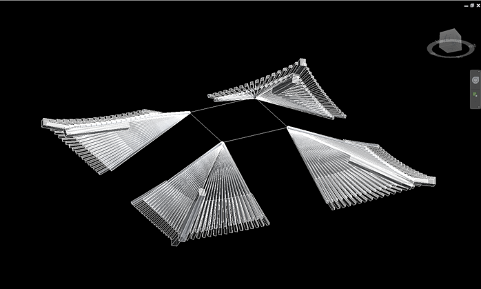
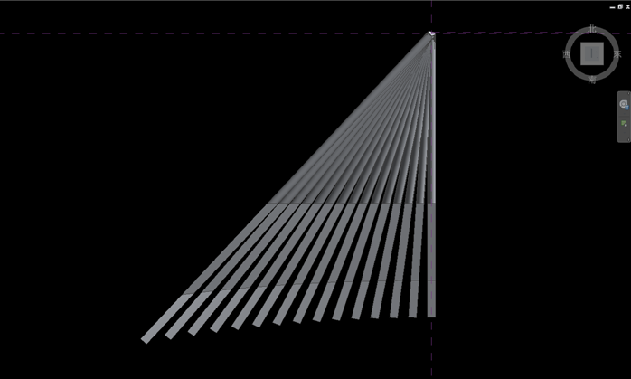

# 古建筑翼角Revit参数化模型说明书

古建筑起翘的翼角恐怕是古建筑当中除了斗栱之外最神秘、最让人神往的部位了。古人云“如鸟斯革 如翚斯飞”就是形容建筑的转角犹如展翅的鸟翼一般。

那么将BIM的参数化设计应用于古建筑的翼角，又将是怎么样的效果呢？

其实古建筑的翼角椽以及翼角飞椽的分布排列是非常有规律的，也是完全可以利用精确的数学模型进行描述（数学模型的具体内容在这里不予公开）。而对于古建筑设计师来讲，他们所关心的无非就是下面的表格中罗列的一些主要参数，比如出檐、平出、起翘、最外一个步架距离等等。下面这张截图就是一个古建筑翼角的主要参数。

我使用Autodesk REVIT软件初步制作了古建筑的翼角族（族的具体制作过程这里不予公开），并测试了其在不同的参数环境下所产生的不同的造型风格。下面四条便是举例说明。

## 1. 翼角椽和翼角飞椽平出的变化所产生的不同造型

- 上图：翼角飞椽平出450mm，翼角椽平出300mm

- 下图：翼角飞椽平出900mm，翼角椽平出600mm

## 2. 起翘和平出综合调整产生的不同造型

- 上图（2张，立面和轴测）：翼角飞椽起翘600mm，平出450mm，翼角椽起翘300mm，平出300mm

- 下图（2张，立面和轴测）：翼角飞椽起翘1600mm，平出600mm，翼角椽起翘1600mm，平出600mm

## 3. 椽经大小的调节所产生的不同效果

- 上图：椽经100mm

- 下图：椽经150mm

## 4. 翼角椽（飞椽）个数的调整

对于不同级别和尺度的建筑，再加上最后一个步架的大小、斗栱出挑数的影响，翼角椽的个数是经常变化的。对于如何处理不同的翼角椽数量，我在单个翼角椽模型当中加入了2个参数：“椽子个数”和“椽号”。

在翼角的嵌套族当中，选择一个翼角椽将会如下图所示。

翼角椽的参数如下图所示。

那么如何修改翼角椽的个数呢？根据我的经验，古建筑的翼角椽（飞椽）一般不会超过17根。那么，我先制作一个拥有17根翼角椽（飞椽）的翼角族，将其备份之后，删除转角处多余的椽子（也就是椽子编号超过修改后的椽子总个数的椽子），再修改每一根翼角椽的“椽子个数”，那么每一根翼角椽的空间位置就会根据新的总个数进行调整。

下面3张图就是不同椽子个数之下的效果（椽子的粗细可以另外再调整，见条款3）。

- 总数15根

- 总数13根

- 总数11根

