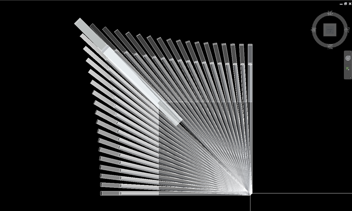
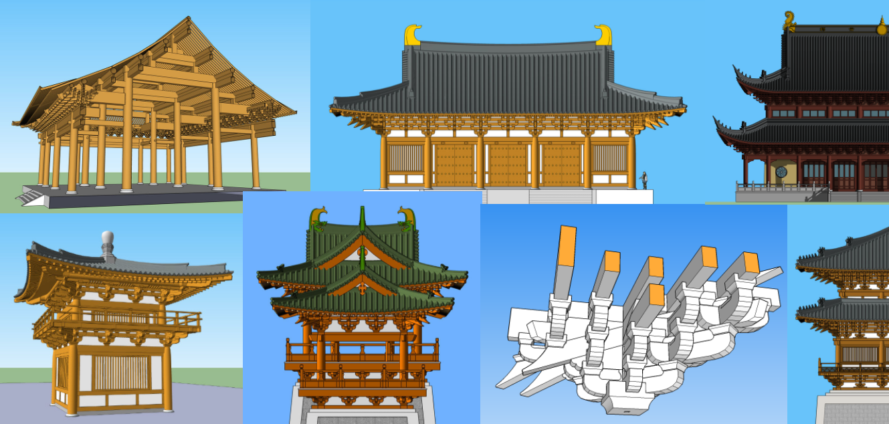

# 古建筑模型库

此古建筑模型库是我大约2011年到2016年对古建筑的研究总结。当中包含了唐代风格、辽宋金风格和清代风格的古建筑木构件的建模和建筑整体的设计。

## 古建筑翼角参数化模型 

详细内容请访问子目录 [REVIT_古建筑翼角](https://github.com/echushe/Architecture_And_BIM/tree/master/REVIT_%E5%8F%A4%E5%BB%BA%E7%AD%91%E7%BF%BC%E8%A7%92)

## 古建筑设计模型库（主要是sketchup模型）

详细内容请访问子目录 [古建筑设计模型库](https://github.com/echushe/Architecture_And_BIM/tree/master/%E5%8F%A4%E5%BB%BA%E7%AD%91%E8%AE%BE%E8%AE%A1%E6%A8%A1%E5%9E%8B%E5%BA%93)

