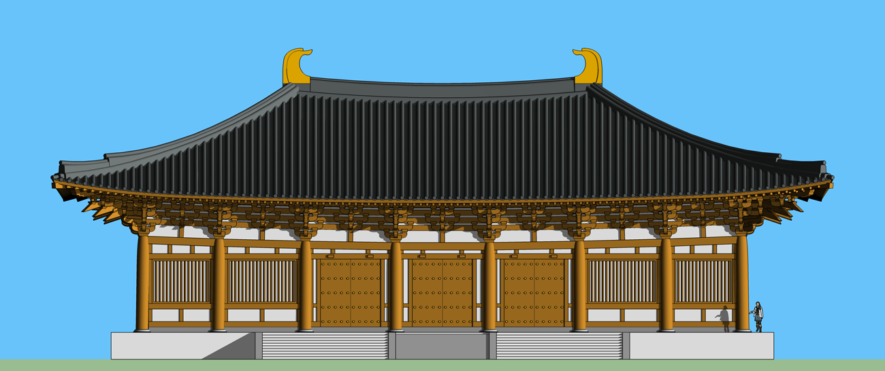
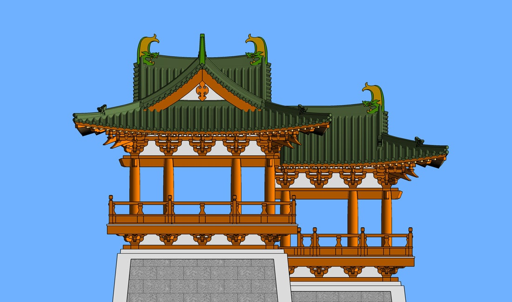
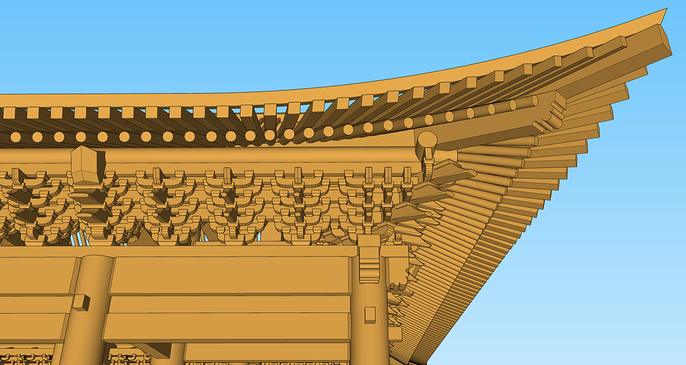
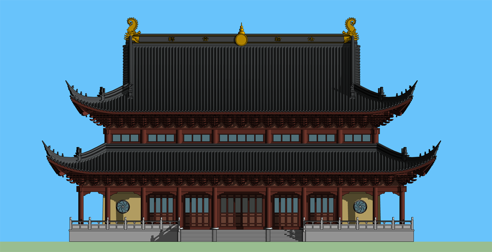

# 古建筑设计模型库

##  [唐式](https://github.com/echushe/Architecture_And_BIM/tree/master/%E5%8F%A4%E5%BB%BA%E7%AD%91%E8%AE%BE%E8%AE%A1%E6%A8%A1%E5%9E%8B%E5%BA%93/%E5%94%90%E5%BC%8F)

## [宋式](https://github.com/echushe/Architecture_And_BIM/tree/master/%E5%8F%A4%E5%BB%BA%E7%AD%91%E8%AE%BE%E8%AE%A1%E6%A8%A1%E5%9E%8B%E5%BA%93/%E5%AE%8B%E5%BC%8F)

## [清式](https://github.com/echushe/Architecture_And_BIM/tree/master/%E5%8F%A4%E5%BB%BA%E7%AD%91%E8%AE%BE%E8%AE%A1%E6%A8%A1%E5%9E%8B%E5%BA%93/%E6%B8%85%E5%BC%8F)

## [苏式](https://github.com/echushe/Architecture_And_BIM/tree/master/%E5%8F%A4%E5%BB%BA%E7%AD%91%E8%AE%BE%E8%AE%A1%E6%A8%A1%E5%9E%8B%E5%BA%93/%E8%8B%8F%E5%BC%8F)

