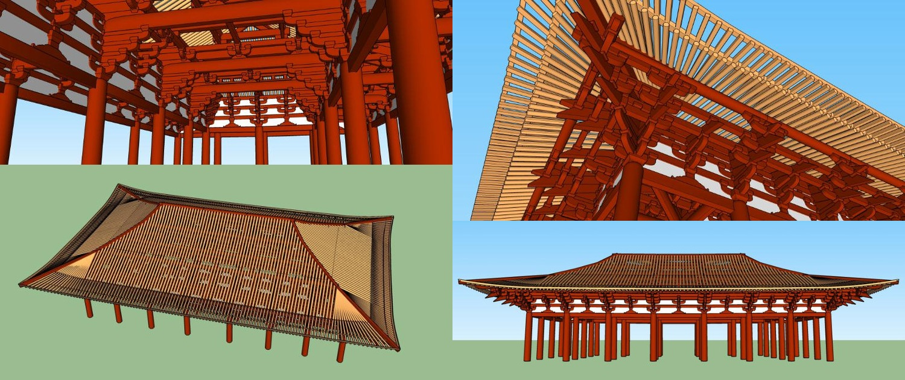

# 唐式建筑模型库

## 1. [使用七铺作的唐风建筑模型](https://github.com/echushe/Architecture_And_BIM/tree/master/%E5%8F%A4%E5%BB%BA%E7%AD%91%E8%AE%BE%E8%AE%A1%E6%A8%A1%E5%9E%8B%E5%BA%93/%E5%94%90%E5%BC%8F/%E4%B8%83%E9%93%BA%E4%BD%9C)

请进入子目录浏览详细内容。

## 2. [使用六铺作的唐风建筑模型](https://github.com/echushe/Architecture_And_BIM/tree/master/%E5%8F%A4%E5%BB%BA%E7%AD%91%E8%AE%BE%E8%AE%A1%E6%A8%A1%E5%9E%8B%E5%BA%93/%E5%94%90%E5%BC%8F/%E5%85%AD%E9%93%BA%E4%BD%9C)

请进入子目录浏览详细内容。

## 3. [使用五铺作的唐风建筑模型](https://github.com/echushe/Architecture_And_BIM/tree/master/%E5%8F%A4%E5%BB%BA%E7%AD%91%E8%AE%BE%E8%AE%A1%E6%A8%A1%E5%9E%8B%E5%BA%93/%E5%94%90%E5%BC%8F/%E4%BA%94%E9%93%BA%E4%BD%9C)

请进入子目录浏览详细内容。

## 4. [实现升起唐风建筑模型](https://github.com/echushe/Architecture_And_BIM/tree/master/%E5%8F%A4%E5%BB%BA%E7%AD%91%E8%AE%BE%E8%AE%A1%E6%A8%A1%E5%9E%8B%E5%BA%93/%E5%94%90%E5%BC%8F/%E5%8D%87%E8%B5%B7)

请进入子目录浏览详细内容。

## 5. [唐代殿堂建筑的大木构架, 有升起和侧脚](https://github.com/echushe/Architecture_And_BIM/blob/master/%E5%8F%A4%E5%BB%BA%E7%AD%91%E8%AE%BE%E8%AE%A1%E6%A8%A1%E5%9E%8B%E5%BA%93/%E5%94%90%E5%BC%8F/%E5%A4%A7%E6%9C%A8%E6%9E%84%E6%9E%B6-%E5%8D%87%E8%B5%B7-%E4%BE%A7%E8%84%9A.skp)

此模型文件的预览如下：

