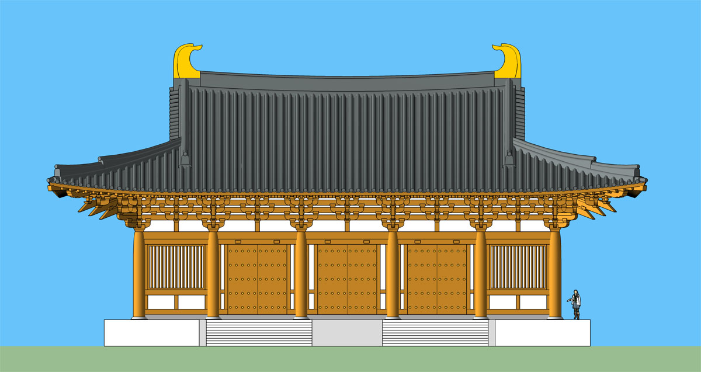
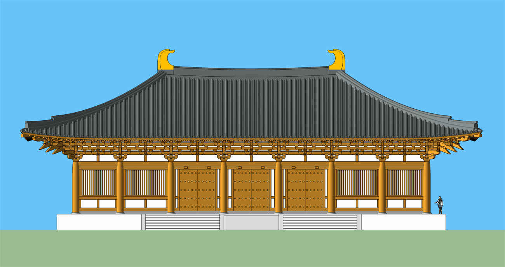
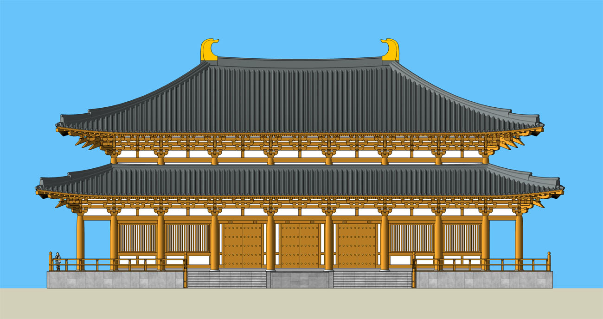

# 使用七铺作的唐代风格建筑模型

## [面闊5開間，進深4開間，歇山式](https://github.com/echushe/Architecture_And_BIM/blob/master/%E5%8F%A4%E5%BB%BA%E7%AD%91%E8%AE%BE%E8%AE%A1%E6%A8%A1%E5%9E%8B%E5%BA%93/%E5%94%90%E5%BC%8F/%E4%B8%83%E9%93%BA%E4%BD%9C/%E4%BA%94-%E5%9B%9B-%E6%AD%87%E5%B1%B1-%E4%B8%83%E9%93%BA%E4%BD%9C%E5%8F%8C%E6%8A%84%E5%8F%8C%E4%B8%8B%E6%98%82.skp)

主要涉及特徵：

廈兩頭造，面闊5間，進深4間，當中三間設版門。

柱頭鋪作採用七鋪作雙抄雙下昂，1跳、3跳偷心，2跳計心重栱造承羅漢方，令栱施批竹耍頭；泥道栱承柱頭方，慢栱隱刻，柱頭方連續層疊當中置散枓；補間鋪作栱眼壁柱栱承柱頭方並出兩跳，施令栱承羅漢方。

升起和側腳未處理。

用大於一等材。

## [面闊7開間，進深4開間，廡殿式](https://github.com/echushe/Architecture_And_BIM/blob/master/%E5%8F%A4%E5%BB%BA%E7%AD%91%E8%AE%BE%E8%AE%A1%E6%A8%A1%E5%9E%8B%E5%BA%93/%E5%94%90%E5%BC%8F/%E4%B8%83%E9%93%BA%E4%BD%9C/%E4%B8%83-%E5%9B%9B-%E5%BA%91%E6%AE%BF-%E4%B8%83%E9%93%BA%E4%BD%9C%E5%8F%8C%E6%8A%84%E5%8F%8C%E4%B8%8B%E6%98%82.skp)

主要涉及特徵：

屋蓋四阿頂，面闊7間，進深4間，當中三間設版門。

柱頭鋪作採用七鋪作雙抄雙下昂，1跳、3跳偷心，2跳計心重栱造承羅漢方，令栱施批竹耍頭；泥道栱承柱頭方，慢栱隱刻，柱頭方連續層疊當中置散枓；補間鋪作栱眼壁柱栱承柱頭方並出兩跳，施令栱承羅漢方。

無普拍方，闌額不出頭，升起和側腳未處理。

用材大於一等材。

## [面闊9開間，進深6開間，重檐廡殿](https://github.com/echushe/Architecture_And_BIM/blob/master/%E5%8F%A4%E5%BB%BA%E7%AD%91%E8%AE%BE%E8%AE%A1%E6%A8%A1%E5%9E%8B%E5%BA%93/%E5%94%90%E5%BC%8F/%E4%B8%83%E9%93%BA%E4%BD%9C/%E4%B9%9D-%E5%85%AD-%E5%BA%91%E6%AE%BF-%E9%87%8D%E6%AA%90-%E4%B8%83%E9%93%BA%E4%BD%9C%E5%8F%8C%E6%8A%84%E5%8F%8C%E4%B8%8B%E6%98%82-%E4%BA%94%E9%93%BA%E4%BD%9C%E5%8F%8C%E6%8A%84.skp)

主要涉及特徵：

屋蓋重檐四阿頂，上層檐面闊7間，進深4間，副階周匝，總面闊9間，進深6間，當中三間設版門。

上檐鋪作採用七鋪作雙抄雙下昂，1跳、3跳偷心，2跳計心重栱造承羅漢方，令栱施批竹耍頭；泥道栱承柱頭方，慢栱隱刻，柱頭方連續層疊當中置散枓；補間鋪作栱眼壁柱栱承柱頭方並出兩跳，施令栱承羅漢方。

副階（下檐）鋪作採用五鋪作出兩抄施令栱，耍頭批竹，1跳偷心，補間鋪作用柱栱，柱栱之上柱頭方隱刻扶壁栱重栱。

無普拍方，闌額不出頭，升起和側腳未處理。

用材大於一等材。

## [面闊9開間，進深5開間，重檐廡殿](https://github.com/echushe/Architecture_And_BIM/blob/master/%E5%8F%A4%E5%BB%BA%E7%AD%91%E8%AE%BE%E8%AE%A1%E6%A8%A1%E5%9E%8B%E5%BA%93/%E5%94%90%E5%BC%8F/%E4%B8%83%E9%93%BA%E4%BD%9C/%E4%B9%9D-%E4%BA%94-%E5%BA%91%E6%AE%BF-%E9%87%8D%E6%AA%90-%E4%B8%83%E9%93%BA%E4%BD%9C%E5%8F%8C%E6%8A%84%E5%8F%8C%E4%B8%8B%E6%98%82-%E4%BA%94%E9%93%BA%E4%BD%9C%E5%8F%8C%E6%8A%84.skp)

此殿除进深少一开间之外，其外立面主要特征和参数与前一例基本相同。

